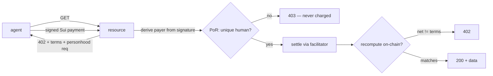

# Verified Agent — the verified-resource gate for the Sui agent economy

**Not "an agent." Infrastructure for safely *selling to* agents.**

A resource server that serves only requests which are **paid** (x402 on Sui) **and**
backed by a **proven unique human** (Proof of Real) — then lets the agent **remember**
(Walrus Memory) and **reason** about its spending (a **local** LLM). The whole stack
is self-sovereign: no centralized dependency anywhere — not even for inference.

> Payment proves *funds*. It does not prove *who is behind the request*. A paid
> endpoint is still trivially sybil-farmed. This gate adds "one real, unique human
> per agent" — verified on-chain, no KYC, no captcha, no allowlist.

## The gate



Personhood is checked **before** settlement (an un-verified agent never pays), and
the settlement is **recomputed** on-chain (don't trust the facilitator). The paying
key *is* the identity we check — no client-claimed addresses.

## Four self-sovereign layers

| Layer | What | Built on |
|-------|------|----------|
| 🪪 Identity | unique-human gate (sybil-resistant, ZK uniqueness) | [`por-sdk`](https://www.npmjs.com/package/por-sdk) on Sui |
| 💸 Payment | x402, settled on Sui, recomputed on-chain | live `sui-facilitator.onrender.com` |
| 🧠 Memory | portable, encrypted, on-chain-owned, cross-session | Walrus Memory (`@mysten-incubation/memwal`) |
| 🤖 Brain | memory-driven spend control (pay only for the unknown) | local Ollama (qwen2.5-coder:14b) |

## Run

```bash
pnpm install
node --env-file=.env --import tsx src/demo.ts     # the flagship demo (all four layers)
```

Per-layer demos: `src/demo-b0.ts` (gate), `src/demo-b1.ts` (memory), `src/demo-b2.ts` (brain).
Setup helpers: `src/init.ts` (identities + faucet), `src/brain-check.ts` (model sanity).
The brain defaults to local Ollama; set `BRAIN_PROVIDER=anthropic` + `ANTHROPIC_API_KEY` to swap.

## A proposed standard

This composition wants to be a **standard**, not a one-off. See
[`spec/x402-personhood-gated-resource.md`](spec/x402-personhood-gated-resource.md) —
a sketch for an x402 extension where any resource can require a personhood proof
alongside payment, composable with the settlement-receipt binding work
([#2666](https://github.com/x402-foundation/x402/pull/2666)).

## Honest scope

- **Testnet.** Real settlements, test funds.
- **Personhood ≠ authority.** This proves a unique human is *behind* the agent — **not**
  that the agent is authorized to act for them, and **not** KYB/KYC. Don't use it as an
  authorization or compliance primitive.
- **Assurance is a spectrum.** L0 = live human + device; `unique:true` is what makes it
  sybil-resistant. A resource should require the level its threat model needs.

## Where this fits

The agent itself isn't the product — it's the keystone demo that ties together a
zero-fee x402 **facilitator** (the wedge) and **PoR** (the proof-of-personhood
product). It exists to show that Sui's primitives compose into an open, verifiable
substrate for the agent economy.
